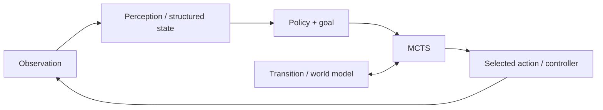

# ddm-mcts

**Decision and planning toolkit with perception-aware robotics**

DDM-MCTS combines pluggable decision policies, Monte Carlo Tree Search, and explicit transition/world models. Optional MuJoCo integration provides snapshot-backed physical planning, Cartesian Panda reaching, and structured run logs. Phase 3 adds camera observations, deterministic perception, semantic targets, and closed-loop physical agents. Start with the [robotics usage guide](docs/robotics/README.md), [perception-aware examples](docs/robotics/PHYSICAL_AI.md), [architecture and concepts](docs/ARCHITECTURE_AND_CONCEPTS.md), and [validation report](docs/robotics/TEST_REPORT.md).



```bash
python -m pip install -e ".[dev,robotics]"
export PANDA_MODEL=/path/to/mujoco_menagerie/franka_emika_panda/scene.xml
python -m ddm_mcts.robotics.cli --target 0.5945 0.02 0.6245
```

Optional [local VLM perception](docs/robotics/LOCAL_VLM.md) adds Qwen3-VL semantic shape reaching through the same planner, using `.[vlm]`. Ground-truth and classical vision remain available.

[Ordered physical tasks](docs/robotics/MULTI_STEP_AGENT.md) reuse those components to execute “Approach the cylinder, then the sphere, then the cube.” The Panda keeps its physical state between subgoals, verifies each safe approach, and produces a task trace. Optional Qwen visual priors guide the original MCTS; their documented upward-motion bias remains a limitation.

Robotics runs live in `robotics_runs/`. The historical research commands and material below remain available.

`ddm-mcts` is a runnable research prototype for testing whether direct decision models (DDMs), [Laya](https://github.com/NandhaKishorM/laya) and [Mica](https://github.com/akivet/Mica-v0.1-4B), can guide Monte Carlo Tree Search toward useful branches with fewer simulations. The testbed covers Connect Four, grid navigation, job scheduling, delivery routing, seeded inventory management, and synthetic delayed reward.

## Run the experiment

```bash
python -m ddm_mcts.cli experiment
```

## View the results

Open `results/latest/REPORT.md`.

The default V4 `--quick` mode covers all six domains at budgets 1 and 5. Standard mode uses 1, 5, 10, 25, and 50; extended mode additionally uses 2, 100, and 250:

```bash
python -m ddm_mcts.cli experiment --quick
python -m ddm_mcts.cli experiment --standard
python -m ddm_mcts.cli experiment --extended
python -m ddm_mcts.cli experiment --standard --ddm laya
python -m ddm_mcts.cli experiment --standard --ddm mica
```

The adaptive ablation compares mandatory root search with and without a deterministic option-order stability check. Stability checking is enabled by default with two total order samples:

```bash
python -m ddm_mcts.cli experiment --standard --order-stability-check on --order-samples 2
python -m ddm_mcts.cli experiment --standard --order-stability-check off
```

The controller starts with the configurable conservative alpha choices `0`, `0.25`, and `0.5`. Low entropy alone never skips mandatory search. Unstable reordered distributions cap alpha, raise the minimum search budget, and may trigger staged escalation. `alpha` controls trust in the DDM prior; `c_puct` remains the separate PUCT exploration coefficient.

Every successful run is retained under a readable name such as `results/v2_trust_2026-09-26_1830/`. Existing legacy experiment folders are left untouched. The report and `trust_sweep.csv` explain that `alpha` controls prior mixing while `c_puct` separately controls tree exploration.

The project does not claim that DDM-guided MCTS is novel or superior. It provides the harness needed to measure it.

## Architecture

```text
                 Decision State
                       |
             +---------+---------+
             |                   |
           Laya                Mica
             |                   |
             +---------+---------+
                       |
             optional permutation
                  averaging (K)
                       |
                  alpha mixing
                       |
                      MCTS
                       |
                    Action
```

The DDM supplies action priors, the environment supplies transitions, and MCTS performs search. `alpha` controls prior trust; `K=1|2|3` controls deterministic permutation averaging. V3's adaptive search remains available as a separate secondary mechanism.

The responsibilities stay deliberately separate:

- **Laya** is learned intuition: `state + legal actions -> probabilities`.
- **MCTS** is explicit look-ahead and deliberation. At each expanded future state it asks the policy for new priors.
- **Environment** is the transition/world model: it applies an action and produces the exact next state. Laya never simulates future boards.
- **Evaluator** determines how desirable a searched future is. V0 uses seeded random rollouts to terminal states.

MCTS depends only on the generic `Policy` interface, not on a specific backend.

## What works

- Immutable Connect Four states, legal moves, deterministic transitions, wins in every direction, draws, and rendering.
- Random, vanilla MCTS, Laya-only, and Laya-guided MCTS agents.
- Standard selection, expansion, rollout, and backpropagation phases.
- Uniform-prior UCT/PUCT for vanilla MCTS and policy-prior PUCT for guided MCTS.
- Fixed simulation budgets and optional entropy-adaptive budgets.
- Alternating-first-player arena with wins/losses/draws, game length, decision latency, and simulation metrics.
- Root action/prior/visit/Q statistics in verbose mode.
- Reproducible JSON and CSV result export.
- Laya evaluation caching by immutable board state.

Selection uses the PUCT-style score

```text
Q(s,a) + c_puct * P(s,a) * sqrt(N(s)) / (1 + N(s,a))
```

Values are stored from the root player's perspective. Opponent nodes minimize that value while retaining the exploration bonus, avoiding the common perspective-sign error.

## Install

Python 3.11 or newer is recommended.

```bash
python -m venv .venv
# Windows: .venv\Scripts\activate
# macOS/Linux: source .venv/bin/activate
python -m pip install -e ".[dev]"
```

The core and standard tests do not install or download Laya. For Laya agents:

```bash
python -m pip install -e ".[laya]"
```

The integration follows Laya's official Python API: `Router(...).predict(state, questions)`. Model weights are downloaded by Laya on first inference. Use `--laya-device cpu|cuda|mps` and optionally `--laya-model english|multilingual|typed-decisions`. Missing Laya produces an actionable error; it is never silently presented as Laya while running a random policy. If an initialized model has a one-off malformed result/inference failure, the event is logged and that state receives an explicit uniform prior so a long benchmark can continue.

Mica uses the official `Mica-v0.1-4B` SystemOne server and its `/v1/systemone` typed `choice` API. Set up and start that repository's server (its README documents the GGUF checkpoint choices), then use `--mica-endpoint`; the default is `http://127.0.0.1:8010/v1/systemone`. The client has no extra Python dependency and never downloads a checkpoint. A missing server is reported as `MICA UNAVAILABLE`, while other selected experiments continue.

## CLI

Show all options:

```bash
python -m ddm_mcts.cli --help
python -m ddm_mcts.cli benchmark --help
```

Play against vanilla MCTS:

```bash
python -m ddm_mcts.cli play --agent mcts --simulations 100
```

Benchmark without Laya:

```bash
python -m ddm_mcts.cli benchmark --agent-a mcts --agent-b random --games 20 --simulations 100
```

Compare budgets (each printed as a separate reproducible result):

```bash
python -m ddm_mcts.cli benchmark --agent-a laya-mcts --agent-b mcts --games 20 --budgets 10 25 50 100 250 500
```

Export a single-budget experiment:

```bash
python -m ddm_mcts.cli benchmark --agent-a mcts --agent-b random --games 20 --simulations 100 --output results/run.json
python -m ddm_mcts.cli benchmark --agent-a mcts --agent-b random --games 20 --simulations 100 --output results/run.csv
```

Adaptive search maps normalized policy entropy linearly between minimum and maximum budgets:

```bash
python -m ddm_mcts.cli benchmark --agent-a laya-mcts --agent-b mcts --games 20 --adaptive --min-simulations 10 --max-simulations 500
```

Low entropy spends fewer simulations; high entropy spends more. This is experimental: Laya confidence is not guaranteed to be calibrated for Connect Four, and confident errors remain possible.

## Development

```bash
python -m pytest
python -m ruff check .
python -m ddm_mcts.cli benchmark --agent-a mcts --agent-b random --games 2 --simulations 10
```

## Automated Experiments

A complete beginner-friendly diagnostic run requires one command:

```bash
python -m ddm_mcts.cli experiment
```

It automatically runs unit tests and evaluates Connect Four, grid navigation, job scheduling, delivery routing, inventory management, and delayed reward. Each domain compares Laya-only, uniform MCTS, root-only Laya guidance, and full-tree Laya guidance where Laya is available. Every completed run contains `REPORT.md`, `results.json`, `run.log`, plus per-domain `results.json`, `decisions.csv`, and `policy_analysis.csv`. `results/latest/` is a Windows-compatible copy of the latest complete run.

Useful options include:

```bash
python -m ddm_mcts.cli experiment --standard
python -m ddm_mcts.cli experiment --budgets 10 25 50 100
python -m ddm_mcts.cli experiment --seed 42 --extended
python -m ddm_mcts.cli experiment --skip-laya  # policy-independent diagnostics only
```

Quick mode defaults to budgets 1/5, standard mode to 1/2/5/10/25/50, and extended mode adds 100/250/500. Extended mode evaluates roughly 60 scenarios, five alphas, nine root budgets, repeated seeds, plus a smaller full-tree sweep; with local Laya this can require thousands of model evaluations and may run for hours. If Laya cannot load, the report records the error and still completes alpha-zero and mock-prior diagnostics.

The main packages are:

- `environments`: generic interface and Connect Four simulator.
- `policies`: generic DDM interface, uniform/random policies, and official Laya adapter.
- `search`: reusable nodes and environment-agnostic MCTS.
- `agents`: policy-only and search agents.
- `evaluation`: arena, metrics, and exports.

## V0 limitations and next experiments

- Laya is used zero-shot; it has not been fine-tuned or calibrated on Connect Four positions.
- Random terminal rollouts are intentionally simple and can be noisy.
- Search trees are rebuilt for each real move; subtree reuse and transposition tables are future work.
- Adaptive search uses a simple linear entropy mapping, not a calibrated stopping rule.
- Multi-budget runs print each result; file export currently accepts one budget per invocation.

The key experiment is strength versus simulation budget, not only aggregate win rate: compare vanilla and guided MCTS at 10, 25, 50, 100, 250, 500, and 1000 simulations to test whether useful priors reduce search cost.

## Closed-loop physical manipulation

The optional robotics toolkit now exposes a [bounded language manipulation agent](docs/robotics/PHYSICAL_AI_AGENT.md) composing semantic perception, high-level MCTS/MuJoCo futures and verified physical cube/cylinder pick-and-place. Existing V1/V2/V3 and deterministic V4 APIs remain available. These are known-scene simulation demonstrations, not unrestricted manipulation or real-hardware safety validation.

## V5 compositional physical reasoning

An additive bounded MuJoCo goal/predicate/interaction agent composes physical support placement, simulation-time waits and physics-searched pushes. See [the V5 guide](docs/robotics/COMPOSITIONAL_PHYSICAL_REASONING.md) for evidence, commands and limitations. Existing V4 modes remain separate.
