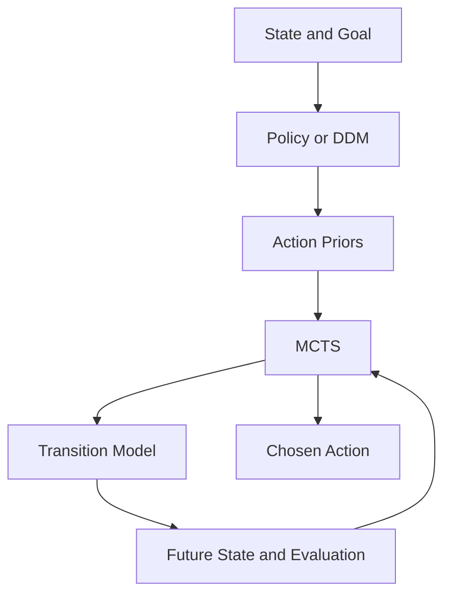
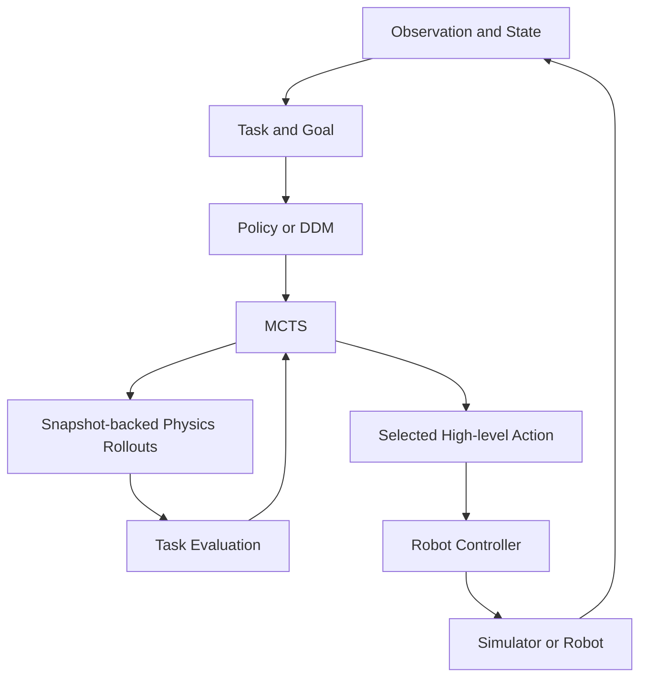

# Architecture and concepts: decisions, search, and physical futures

This guide covers the historical decision experiments and the Phase 2 robotics toolkit. Historical code is in `ddm_mcts/environments`, `policies`, `search`, `agents`, and `evaluation`; robotics is in `ddm_mcts/robotics`. The experiment filenames containing v2/v4 predate the robotics phase and remain historical code. This checkout contains only `results/.gitkeep`, not numerical experiment reports, so this guide makes no numerical V1 performance claims.

## Direct decisions and deliberation

A direct decision follows `state -> policy -> action`. Search instead constructs candidate actions, transitions to possible future states, evaluates those states, and selects a current action using that evidence. A fast model can supply intuition about which branches deserve attention; explicit search tests consequences against a world model. Neither component guarantees an optimal decision.

A policy represents π(a | s, g), a distribution over available actions given state s and goal/context g. The repository's `Policy.probabilities(state, legal_actions)` returns a mapping from semantic actions to weights. Goals can be embedded in the immutable state or supplied through a policy's objective. `normalize_probabilities` filters illegal, negative, and nonfinite weights, normalizes the remainder, and uses uniform probabilities if no positive legal mass remains.

A DDM scores a finite set of options rather than needing to generate arbitrary text. `TextLayaPolicy` and `MicaPolicy` label choices as option_0, option_1, etc., then map returned probabilities back to the original actions. Their state renderer is supplied by the developer. The Connect Four-specific Laya adapter remains useful for historical board experiments; robotics uses the generic text adapter.

Low entropy means a concentrated distribution, not correctness. A model can be consistently confident about a bad action. Tests and diagnostics in `tests/test_mica_and_permutations.py`, `tests/test_adaptive_agent.py`, and `ddm_mcts/evaluation/v4_experiment.py` exercise presentation sensitivity and conservative trust mechanisms. They are not evidence that any deployed model is calibrated.

## The actual MCTS algorithm

`ddm_mcts/search/mcts.py` implements PUCT with values stored from the root player's perspective. Each search constructs a new tree. Expansion eagerly creates a child transition for every legal action, rather than lazily creating one child. The root is expanded before the simulation loop.

Selection traverses expanded nodes. Expansion queries the policy and constructs successors. Simulation/evaluation uses either a seeded random rollout to a terminal state or an injected leaf evaluator. Backup adds the same root-perspective value to every visited ancestor and increments visits. There is no discounting or intermediate reward accumulation in search itself; tasks must encode the desired return in their state/evaluator.

A node holds N(s), its visit count; its child stores N(s,a), action-edge visits, a value sum, and P(s,a), the normalized prior. Q(s,a) is the child value sum divided by its visit count, or zero before visits. The exact selection score is:

```
exploitation + c_puct * P(s,a) * sqrt(max(1, N(s))) / (1 + N(s,a))
```

Exploitation is Q at a maximizing node and -Q at an opponent node. Random seeded tie breaking handles equal scores. The final action is chosen by greatest root child visit count, with random tie breaking. Uniform priors still use PUCT; there is no separate logarithmic UCT implementation.

The exploration term rewards promising underexplored branches; the value term rewards simulated outcomes. Priors have greatest influence early. Repeated evidence can overcome misleading priors, but finite budgets, zero-probability branches, and an inaccurate evaluator can prevent recovery. Reward scale matters relative to c_puct.

## DDM plus search

The combined path is state -> DDM -> action priors -> MCTS -> evaluated futures -> action. DDM-only agents skip futures. Uniform MCTS searches without learned guidance. Guided MCTS does more than select the model's largest probability: it chooses using visits accumulated from transition/evaluation evidence.

`MixedPolicy` implements P_search = (1-alpha) P_uniform + alpha P_DDM. Alpha is trust in a prior, independent of c_puct. Alpha zero bypasses the learned policy entirely. Root-only guidance is supported by MCTS's `root_policy`; ordinary `policy` provides priors at expanded states throughout the tree.

`PermutationAveragedPolicy` evaluates up to three deterministic option orders. Each distribution is keyed by semantic action before averaging, so an action retains its identity across presentation positions. This can reduce order sensitivity without proving correctness. Cache keys include state, action order, sample count, and seed.

`AdaptiveLayaMCTSAgent` checks reordered probabilities, top-choice agreement, mean absolute probability change, and rank correlation. It chooses conservative alpha levels, caps trust after instability, and may run a larger second search. This historical adaptive agent uses terminal rollouts by default; Phase 2 exposes fixed-budget physical planning rather than automatically applying this agent to robots.

## The transition model is essential

MCTS requires s_next = T(s, a). It does not infer physics from action names. Connect Four supplies game rules; routing supplies travel costs and remaining destinations; scheduling updates time, deadlines, and accumulated utility. Inventory uses seeded demand transitions. Robotics supplies a simulator plus controller.



The existing `Environment` interface describes deterministic two-player zero-sum environments, but its single-agent implementations return the same player at every state. The robotics adapter uses this established convention, so physical search always maximizes the task objective.

## Physical planning and branching

`RoboticsEnvironment` describes a mutable world: observation, legal actions, execution, snapshot, restore, and reset. `Task` independently supplies evaluation, success, and terminal detection. `SimulatorAdapter` presents immutable `SearchState(observation, snapshot, depth)` objects to the historical search core. For every transition it saves the current live snapshot, restores the requested branch, executes physics, captures a successor, and restores the live snapshot in a finally block. Action enumeration also runs in the requested snapshot and restores the live world. Planning has no execution side effect even when a transition raises an exception.

The adapter ends branches at a configurable horizon or task terminal state. `RoboticsPlanner` supplies task evaluation at leaves rather than allowing unbounded random physical rollouts. It replans from the live environment after each executed action. Its tree therefore explores multiple actions and depths, but uses a heuristic at nonterminal leaves; this is finite-horizon physical deliberation, not an optimal infinite-horizon controller.

MuJoCo is the first world model, isolated in `mujoco_backend.py`. Integration snapshots use `mj_getState` / `mj_setState` with `mjSTATE_INTEGRATION`. This captures the installed version's integration inputs: time, qpos, qvel, actuator activation/history when present, warmstart accelerations, controls, applied forces, equality activation, mocap poses, userdata, and plugin state. The backend calls `mj_forward` after restoration and reapplies the integration vector to preserve any inputs recomputation changed. See the [official state documentation](https://mujoco.readthedocs.io/en/latest/programming/simulation.html#integration-state).

Snapshots include robot action count in addition to physics. They are immutable tuples and bound to a backend instance to reject cross-model restoration. Models and task configuration must remain fixed during search. Derived render buffers and diagnostics are not saved. Python callbacks, external plugin resources, and random state outside MuJoCo require their own snapshot strategy. Determinism is tested on the same model/version/platform; cross-version bitwise reproducibility is not promised. Instances are sequential, with one backend needed per concurrent worker.



The diagram includes a future robot execution destination; Phase 2 implements simulator execution only.

## High-level decisions and low-level control

MCTS selects a `CartesianAction`, such as MOVE_X_POS with a 2 cm displacement. `CartesianController` turns displacement into joint position commands. Physics integrates those commands over a configurable number of steps. Panda-specific joint names, actuators, hand body, home keyframe, and gravity compensation occur only in the factory, never in MCTS.

Position-only inverse kinematics uses:

```
e = target_position - current_position
Δq = Jᵀ (J Jᵀ + λ² I)⁻¹ e
```

J is a translational Jacobian, λ is positive damping, and Δq is a joint update. The implementation solves the linear system instead of computing an inverse. Damping regularizes poorly conditioned directions near singularities. It limits each iterative joint update, clips joint positions to joint limits, clips actuator commands to control ranges, limits action displacement, and bounds iterations. IK runs in scratch MjData; it never teleports the live robot. The live world moves through actuator control and `mj_step`.

The controller assumes scalar joints and matching joint position actuators. It holds the gripper at the model's reset command. Reach success is distance <= epsilon; objective is negative Euclidean distance; maximum executed steps provides failure termination. Orientation, collision-aware trajectory generation, and arbitrary unreachable-goal recovery are outside this phase. Panda gravity compensation prevents position-servo sag from accumulating during repeated Cartesian actions. This is an explicit example-model configuration.

## Extension boundaries

A new simulator implements the mutable contract and complete branching snapshots. A new task changes evaluation and terminal conditions. A new action space supplies hashable action values and a controller interpretation. A policy consumes observations and legal actions; it never touches physics. The planner consumes transitions and scores; it never interprets Panda joints.

Board states, remaining routing destinations, scheduling job sets, and robot integration snapshots are different state representations serving the same search interface. `ControlledRobot` and `ReachState` are reusable reaching helpers, not requirements on every robotics environment. Custom environments may use other state types and action semantics.

## Compute accounting and robustness

A logical policy request is an attempt to obtain priors. A cache hit avoids model evaluation; a miss may cause physical inference. Laya and Mica diagnostics separately count requests, hits, misses, calls, inference errors, and inference time. Permutation averaging can multiply underlying calls. Root-only versus full-tree guidance can differ substantially in inference count because expansion asks for priors at each expanded state.

Search simulations are not the number of physics transitions: eager expansion creates one physical successor per legal action at each expanded node. Planning time includes policy rendering/cache/inference, transition simulation, evaluation, and tree work. Total decision latency additionally includes real action execution and logging. Run logs record planning time, simulation budget, root statistics, and available policy diagnostics; they do not currently expose every internal physics substep counter. Historical accounting lives in `ddm_mcts/evaluation` and the policy diagnostics methods.

Misleading priors can hurt small budgets. Larger budgets can help when the transition model and evaluator are reliable. Trust mixing preserves exploration mass; permutation averaging addresses presentation instability; adaptive search allocates additional effort after disagreement. These mechanisms address distinct problems and are not guarantees. In robotics, simulator mismatch, controller approximation, contacts, and objective design add uncertainty even when priors are excellent. Safety constraints need to be supplied by a task/environment; Phase 2 is not a real-robot safety system.

## Future perception and VLDM direction

Future architecture may use camera -> perception -> structured state -> DDM -> MCTS -> physical action. That VLM-to-DDM pipeline has separate perception and decision components. A true joint Vision-Language-Decision Model would instead consume vision, a language goal, and candidate decisions together and produce decision probabilities for search. Both still require a world model to predict consequences. Phase 2 implements neither cameras, perception, VLM/VLDM, training, ROS, nor real hardware execution.
