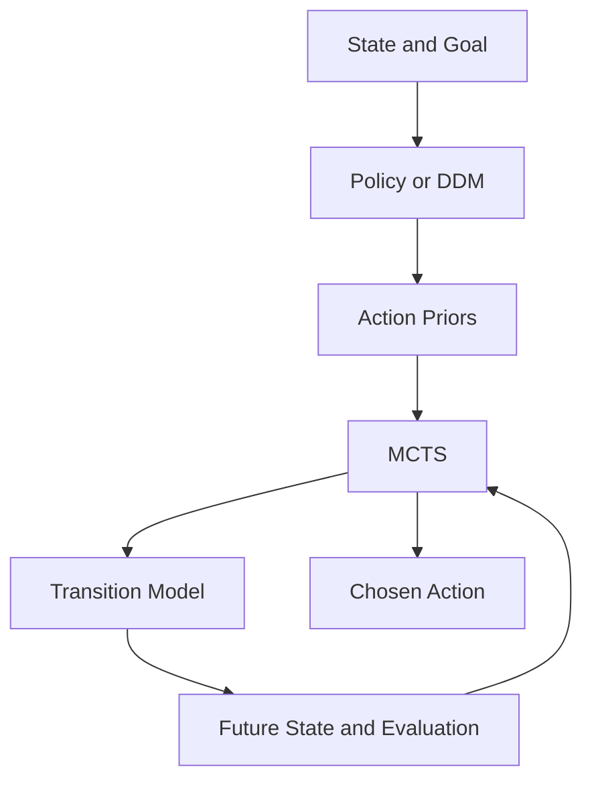
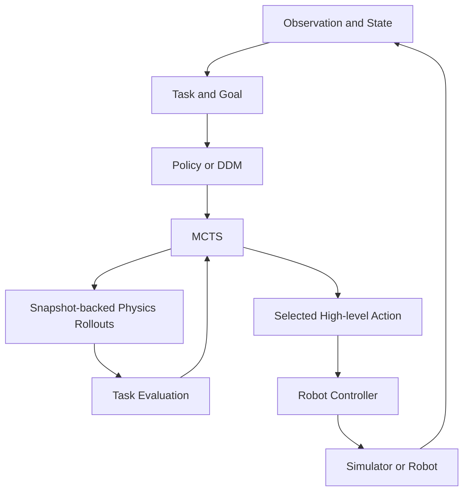
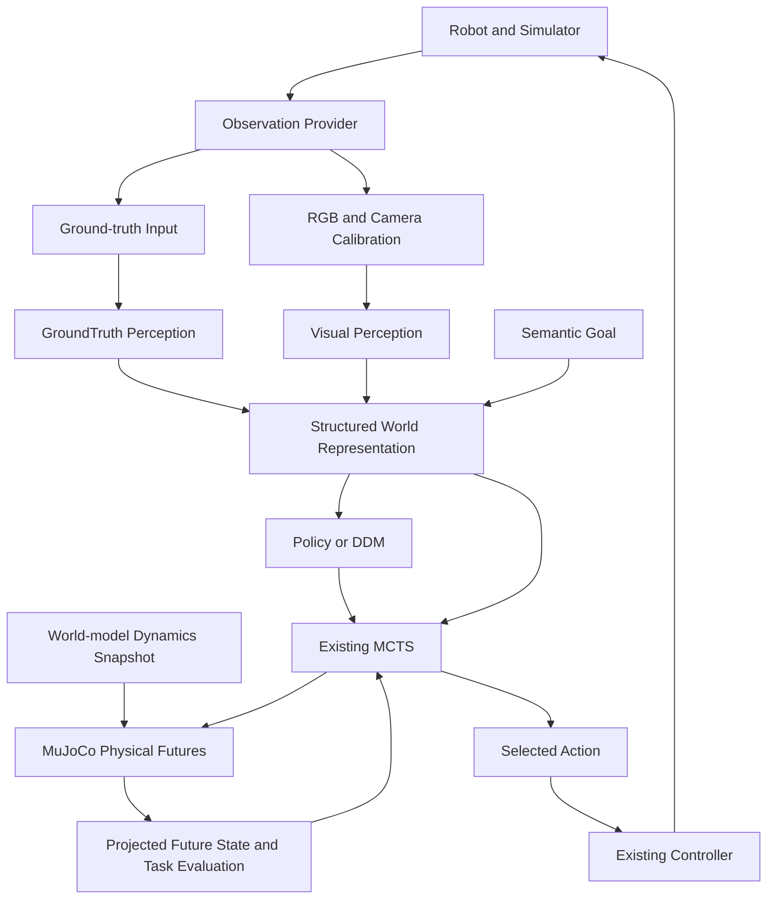
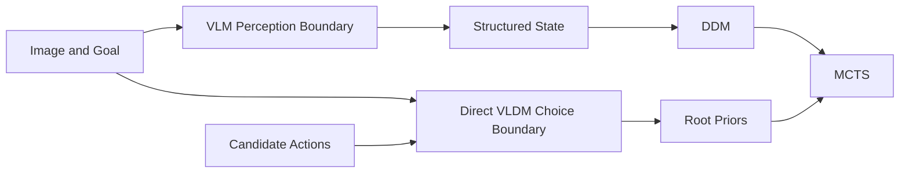
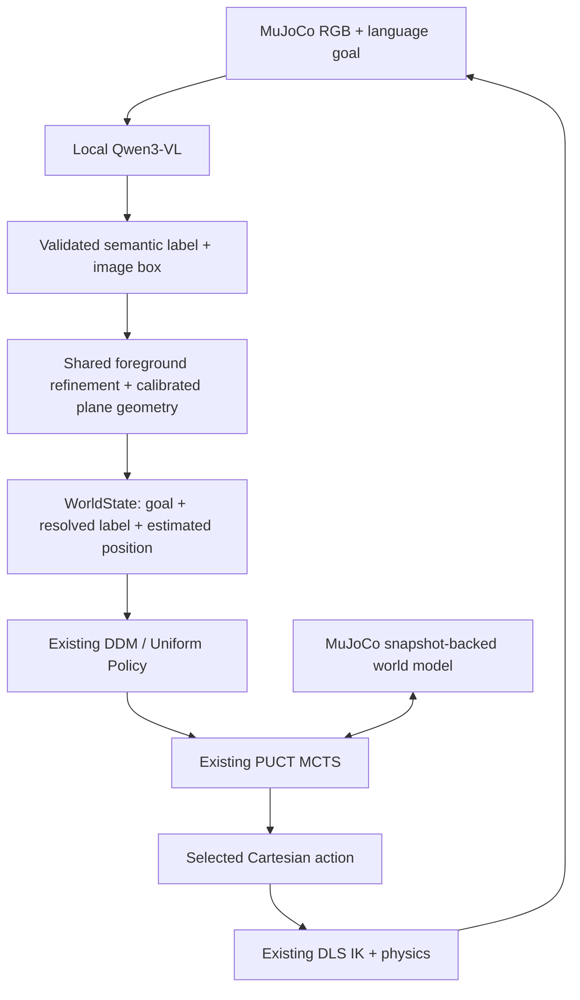
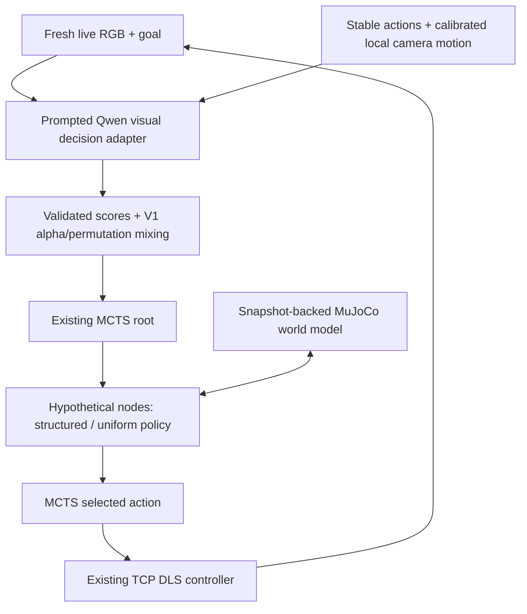

# Architecture and concepts: decisions, search, and physical futures

This guide covers the historical decision experiments, the Phase 2 robotics toolkit, and the Phase 3 perception-aware extension. Historical code is in `ddm_mcts/environments`, `policies`, `search`, `agents`, and `evaluation`; robotics is in `ddm_mcts/robotics`. The experiment filenames containing v2/v4 predate the robotics phase and remain historical code. This checkout contains only `results/.gitkeep`, not numerical experiment reports, so this guide makes no numerical V1 performance claims.

## Direct decisions and deliberation

A direct decision follows `state -> policy -> action`. Search instead constructs candidate actions, transitions to possible future states, evaluates those states, and selects a current action using that evidence. A fast model can supply intuition about which branches deserve attention; explicit search tests consequences against a world model. Neither component guarantees an optimal decision.

A policy represents π(a | s, g), a distribution over available actions given state s and goal/context g. The repository's `Policy.probabilities(state, legal_actions)` returns a mapping from semantic actions to weights. Goals can be embedded in the immutable state or supplied through a policy's objective. `normalize_probabilities` filters illegal, negative, and nonfinite weights, normalizes the remainder, and uses uniform probabilities if no positive legal mass remains.

A DDM scores a finite set of options rather than needing to generate arbitrary text. `TextLayaPolicy` and `MicaPolicy` label choices as option_0, option_1, etc., then map returned probabilities back to the original actions. Their state renderer is supplied by the developer. The Connect Four-specific Laya adapter remains useful for historical board experiments; robotics uses the generic text adapter.

Low entropy means a concentrated distribution, not correctness. A model can be consistently confident about a bad action. Tests and diagnostics in `tests/test_mica_and_permutations.py`, `tests/test_adaptive_agent.py`, and `ddm_mcts/evaluation/v4_experiment.py` exercise presentation sensitivity and conservative trust mechanisms. They are not evidence that any deployed model is calibrated.

## The actual MCTS algorithm

`ddm_mcts/search/mcts.py` implements PUCT with values stored from the root player's perspective. Each search constructs a new tree. Expansion eagerly creates a child transition for every legal action, rather than lazily creating one child. The root is expanded before the simulation loop.

Selection traverses expanded nodes. Expansion queries the policy and constructs successors. Simulation/evaluation uses either a seeded random rollout to a terminal state or an injected leaf evaluator. Backup adds the same root-perspective value to every visited ancestor and increments visits. There is no discounting or intermediate reward accumulation in search itself; tasks must encode the desired return in their state/evaluator.

A node holds N(s), its visit count; its child stores N(s,a), action-edge visits, a value sum, and P(s,a), the normalized prior. Q(s,a) is the child value sum divided by its visit count, or zero before visits. The exact selection score is:

```
exploitation + c_puct * P(s,a) * sqrt(max(1, N(s))) / (1 + N(s,a))
```

Exploitation is Q at a maximizing node and -Q at an opponent node. Random seeded tie breaking handles equal scores. The final action is chosen by greatest root child visit count, with random tie breaking. Uniform priors still use PUCT; there is no separate logarithmic UCT implementation.

The exploration term rewards promising underexplored branches; the value term rewards simulated outcomes. Priors have greatest influence early. Repeated evidence can overcome misleading priors, but finite budgets, zero-probability branches, and an inaccurate evaluator can prevent recovery. Reward scale matters relative to c_puct.

## DDM plus search

The combined path is state -> DDM -> action priors -> MCTS -> evaluated futures -> action. DDM-only agents skip futures. Uniform MCTS searches without learned guidance. Guided MCTS does more than select the model's largest probability: it chooses using visits accumulated from transition/evaluation evidence.

`MixedPolicy` implements P_search = (1-alpha) P_uniform + alpha P_DDM. Alpha is trust in a prior, independent of c_puct. Alpha zero bypasses the learned policy entirely. Root-only guidance is supported by MCTS's `root_policy`; ordinary `policy` provides priors at expanded states throughout the tree.

`PermutationAveragedPolicy` evaluates up to three deterministic option orders. Each distribution is keyed by semantic action before averaging, so an action retains its identity across presentation positions. This can reduce order sensitivity without proving correctness. Cache keys include state, action order, sample count, and seed.

`AdaptiveLayaMCTSAgent` checks reordered probabilities, top-choice agreement, mean absolute probability change, and rank correlation. It chooses conservative alpha levels, caps trust after instability, and may run a larger second search. This historical adaptive agent uses terminal rollouts by default; Phase 2 exposes fixed-budget physical planning rather than automatically applying this agent to robots.

## The transition model is essential

MCTS requires s_next = T(s, a). It does not infer physics from action names. Connect Four supplies game rules; routing supplies travel costs and remaining destinations; scheduling updates time, deadlines, and accumulated utility. Inventory uses seeded demand transitions. Robotics supplies a simulator plus controller.



The existing `Environment` interface describes deterministic two-player zero-sum environments, but its single-agent implementations return the same player at every state. The robotics adapter uses this established convention, so physical search always maximizes the task objective.

## Physical planning and branching

`RoboticsEnvironment` describes a mutable world: observation, legal actions, execution, snapshot, restore, and reset. `Task` independently supplies evaluation, success, and terminal detection. `SimulatorAdapter` presents immutable `SearchState(observation, snapshot, depth)` objects to the historical search core. For every transition it saves the current live snapshot, restores the requested branch, executes physics, captures a successor, and restores the live snapshot in a finally block. Action enumeration also runs in the requested snapshot and restores the live world. Planning has no execution side effect even when a transition raises an exception.

The adapter ends branches at a configurable horizon or task terminal state. `RoboticsPlanner` supplies task evaluation at leaves rather than allowing unbounded random physical rollouts. It replans from the live environment after each executed action. Its tree therefore explores multiple actions and depths, but uses a heuristic at nonterminal leaves; this is finite-horizon physical deliberation, not an optimal infinite-horizon controller.

MuJoCo is the first world model, isolated in `mujoco_backend.py`. Integration snapshots use `mj_getState` / `mj_setState` with `mjSTATE_INTEGRATION`. This captures the installed version's integration inputs: time, qpos, qvel, actuator activation/history when present, warmstart accelerations, controls, applied forces, equality activation, mocap poses, userdata, and plugin state. The backend calls `mj_forward` after restoration and reapplies the integration vector to preserve any inputs recomputation changed. See the [official state documentation](https://mujoco.readthedocs.io/en/latest/programming/simulation.html#integration-state).

Snapshots include robot action count in addition to physics. They are immutable tuples and bound to a backend instance to reject cross-model restoration. Models and task configuration must remain fixed during search. Derived render buffers and diagnostics are not saved. Python callbacks, external plugin resources, and random state outside MuJoCo require their own snapshot strategy. Determinism is tested on the same model/version/platform; cross-version bitwise reproducibility is not promised. Instances are sequential, with one backend needed per concurrent worker.



The diagram includes a future robot execution destination; Phase 2 implements simulator execution only.

## High-level decisions and low-level control

MCTS selects a `CartesianAction`, such as MOVE_X_POS with a 2 cm displacement. `CartesianController` turns displacement into joint position commands. Physics integrates those commands over a configurable number of steps. Panda-specific joint names, actuators, hand body, home keyframe, and gravity compensation occur only in the factory, never in MCTS.

Position-only inverse kinematics uses:

```
e = target_position - current_position
Δq = Jᵀ (J Jᵀ + λ² I)⁻¹ e
```

J is a translational Jacobian, λ is positive damping, and Δq is a joint update. The implementation solves the linear system instead of computing an inverse. Damping regularizes poorly conditioned directions near singularities. It limits each iterative joint update, clips joint positions to joint limits, clips actuator commands to control ranges, limits action displacement, and bounds iterations. IK runs in scratch MjData; it never teleports the live robot. The live world moves through actuator control and `mj_step`.

The controller assumes scalar joints and matching joint position actuators. It holds the gripper at the model's reset command. Reach success is distance <= epsilon; objective is negative Euclidean distance; maximum executed steps provides failure termination. Orientation, collision-aware trajectory generation, and arbitrary unreachable-goal recovery are outside this phase. Panda gravity compensation prevents position-servo sag from accumulating during repeated Cartesian actions. This is an explicit example-model configuration.

## Extension boundaries

A new simulator implements the mutable contract and complete branching snapshots. A new task changes evaluation and terminal conditions. A new action space supplies hashable action values and a controller interpretation. A policy consumes observations and legal actions; it never touches physics. The planner consumes transitions and scores; it never interprets Panda joints.

Board states, remaining routing destinations, scheduling job sets, and robot integration snapshots are different state representations serving the same search interface. `ControlledRobot` and `ReachState` are reusable reaching helpers, not requirements on every robotics environment. Custom environments may use other state types and action semantics.

## Compute accounting and robustness

A logical policy request is an attempt to obtain priors. A cache hit avoids model evaluation; a miss may cause physical inference. Laya and Mica diagnostics separately count requests, hits, misses, calls, inference errors, and inference time. Permutation averaging can multiply underlying calls. Root-only versus full-tree guidance can differ substantially in inference count because expansion asks for priors at each expanded state.

Search simulations are not the number of physics transitions: eager expansion creates one physical successor per legal action at each expanded node. Planning time includes policy rendering/cache/inference, transition simulation, evaluation, and tree work. Total decision latency additionally includes real action execution and logging. Run logs record planning time, simulation budget, root statistics, and available policy diagnostics; they do not currently expose every internal physics substep counter. Historical accounting lives in `ddm_mcts/evaluation` and the policy diagnostics methods.

Misleading priors can hurt small budgets. Larger budgets can help when the transition model and evaluator are reliable. Trust mixing preserves exploration mass; permutation averaging addresses presentation instability; adaptive search allocates additional effort after disagreement. These mechanisms address distinct problems and are not guarantees. In robotics, simulator mismatch, controller approximation, contacts, and objective design add uncertainty even when priors are excellent. Safety constraints need to be supplied by a task/environment; Phase 2 is not a real-robot safety system.

## Model-based perception and VLDM direction

Phase 3 implements camera -> deterministic perception -> structured state -> DDM/uniform policy -> MCTS -> physical action. Future model-based perception can use the same boundary. That VLM-to-DDM pipeline has separate perception and decision components. A true joint Vision-Language-Decision Model would instead consume vision, a language goal, and candidate decisions together and produce decision probabilities for search. Both still require a world model to predict consequences. Phase 2 implements neither cameras, perception, VLM/VLDM, training, ROS, nor real hardware execution.

## Observation, perception, and representation

Observation is what the agent receives, not necessarily a complete physical state. We can write `o_t = H(x_t)` for a sensor mapping H from world-model state x_t. Perception constructs an estimated decision representation `s_hat_t = F(o_t, g)` given raw observation and goal g. The robot then chooses an action using that representation and a transition/world model. Neither a picture nor a list of detected objects necessarily contains joint velocities, actuator state, contacts, or other quantities needed to simulate physics.

`Observation` carries a timestamp, sequence, source, robot telemetry, and optional structured entities/RGB/calibration. `ObservationProvider` abstracts acquisition. GroundTruthObservationProvider supplies privileged simulation information explicitly; GroundTruthPerception resolves that structured observation without an image model. This is a debugging baseline, not a deprecated path. Phase 2's original direct-state API remains supported, and explicit ground-truth observation planning reproduces its search results.

`WorldState` is an immutable reaching representation: robot state, labeled entities, semantic goal, and representation source. Entities include estimated positions and observed/stale metadata. `SemanticReachTask` resolves “reach red” to the red entity, then supplies the existing ReachTask objective. Changing the observation source, perception method, or entity label does not change MCTS. This is deliberately a small task-specific representation rather than a universal scene ontology.

## A live estimate is different from a rollout state

Phase 3 makes the distinction explicit:

- Decision context: perceived target/entities, semantic goal, and observed robot state.
- Dynamics initialization: full privileged live MuJoCo integration snapshot.
- Future observation projection: physics-predicted robot motion combined with the current perceived target/entity estimates.

`RoboticsPlanner.plan(observation, state_projection=...)` supports this split while retaining its original no-argument Phase 2 behavior. SimulatorAdapter still snapshots/restores each branch. `WorldState.predict_observation` carries estimated static targets into predicted future observations rather than consulting true scene coordinates. MCTS therefore searches physical robot futures toward a perceived goal. It does not step RGB, acquire speculative images, or use ground-truth target positions to repair perception.

The current demo intentionally mixes camera target perception with simulator robot proprioception and privileged dynamics initialization. This is not a claim that a camera reconstructs a complete robot/simulator state. A future state estimator, belief-state planner, learned world model, or real-robot adapter must provide the missing dynamics-state boundary. If an estimate and rollout initialization disagree, the planner can simulate the wrong futures despite correct search mathematics.

## Calibrated camera observations

MujocoCameraObservationProvider renders a named perspective camera into a separate model/data copy. RGB has shape HxWx3, dtype uint8, RGB channel order, and top-left origin. It returns a read-only image and camera pose/intrinsics metadata; rendering/recomputation never modify the live simulator. Snapshot/restore and same-state image replay are tested. Offscreen rendering is independent of the optional viewer camera and can use EGL without any display. An OpenGL backend is still needed for rasterization.

For the implemented fovy camera model, pixels are square, the principal point is centered, and `f = H / (2 tan(fovy/2))`. With pixel-index centers `cx=(W-1)/2`, `cy=(H-1)/2`, camera-to-world rotation R, and optical center C, a world point p transforms into camera coordinates `p_cam = R^T (p-C)`. MuJoCo looks along local -Z with +X right and +Y up. Projection is:

```
u = cx + f * p_cam.x / (-p_cam.z)
v = cy - f * p_cam.y / (-p_cam.z)
```

The opposite Y sign converts camera-up to image-down. Unprojection needs depth or another constraint. The Phase 3 demo uses a known horizontal target plane:

```
r = R * [(u-cx)/f, -(v-cy)/f, -1]
t = (z_plane-C.z) / r.z
p = C + t*r
```

Parallel rays and intersections behind the camera fail. The calibrated plane is explicit environmental knowledge; it does not identify which target is red or where that target lies in XY. Arbitrary 3D localization from RGB alone remains underdetermined. Perspective fovy cameras are supported; orthographic/sensor-size intrinsic models are rejected by this provider. See the [official coordinate conventions](https://mujoco.readthedocs.io/en/stable/programming/visualization.html).

ColorPlanePerception uses configured color chromaticities, brightness/area thresholds, connected components, and region centroids. It rejects similarly sized ambiguous regions. It estimates target position through calibrated ray-plane intersection, not a MuJoCo target lookup. Tests relocate the colored markers and recover their changed positions from new pixels. Thin, saturated, well-separated static disks on the calibrated plane are assumptions of this baseline.

Occlusion can bias a centroid. The implemented tracker retains a previously observed estimate for a bounded number of missed/partial frames, explicitly marking it stale and logging a warning. This supports the static-target reaching demo; it does not prove the current position of an invisible or moving object. An absent or expired selected entity stops execution. Observation/estimation uncertainty is not yet propagated mathematically into MCTS values or priors.

## Closed-loop physical deliberation

PhysicalAgent coordinates existing components. Before each decision it observes, perceives, resolves the task goal, and supplies a structured root and prediction projection to RoboticsPlanner. The original run loop applies the selected action through ControlledRobot/controller/physics and then observes again. A final fresh observation supports terminal evaluation. Thus the default is receding-horizon `observe -> perceive -> plan -> act -> observe`, not execution of a precomputed open-loop sequence.



The execution viewer is an observer of selected live actions, with isolated display copies. It never displays rollout snapshots. Camera observations also occur only at live decision boundaries. Moving the viewer's camera does not change sensor calibration or planning state. While MCTS computes, the displayed robot is stationary.

Acquisition, perception, planning, execution, and logging are separate latency components. Phase 3 logs acquire/perceive timings per observation, planning/execution timings per action, representation source, entity visibility, optional images, and optional diagnostic errors. MCTS simulations still differ from physical transition/substep counts because expansion eagerly evaluates every action. DDM cache/request/inference diagnostics retain their original meanings.

## Structured VLM perception versus direct VLDM decisions

The existing structured policy boundary remains `π(a | s_hat, g)`. A future VLM can implement ModelPerceptionAdapter's injected `(observation, goal) -> WorldState` predictor. That is image interpretation followed by a separate structured decision model and MCTS. The current code validates schema/goal identity and tests an offline predictor; it contains no real VLM backend.

A direct VLDM instead scores `(image, language goal, candidate actions) -> P(actions)`. VisualDecisionModel and VisualDecisionPolicy define that separate optional boundary. PhysicalAgent binds the latest live image before each decision and attaches the adapter as MCTS's root policy. Deeper nodes use ordinary uniform/structured DDM priors, because Phase 3 has no predicted future-image generator. Calling the direct visual adapter at non-root states is rejected; reusing a live image as though it depicted a future state would be misleading.



The two paths can coexist, but a callable interface or injected mock is not a trained model. No VLM/VLDM training, automatic model download, hardware integration, ROS, or reinforcement learning is implemented.

## Ground-truth diagnostics and sim-to-real considerations

Simulation provides ground truth for optional evaluation after inference. Diagnostic callbacks compare each perceived target position to its true scene position and log Euclidean error; the visual algorithm never consumes those answers. Robot proprioception and privileged world-model initialization are separately disclosed rather than counted as visual estimates. Success is measured against the estimated goal; diagnostic true-target distances help check whether that success is physically meaningful.

Sensor calibration error, lighting changes, occlusion, stale detections, dynamics mismatch, and latency can all invalidate a physical plan. Real deployment would require calibrated sensing, uncertainty/failure policies, a dynamics initializer/estimator, robot-specific execution constraints, and safety validation. Adding a VLM does not solve these issues automatically. The deterministic camera/color baseline establishes testable architectural boundaries and closed-loop execution; it does not establish robust general perception or real-robot safety.

## V3 Phase 1: real local semantic perception

The optional `Qwen3VLBackend` now implements actual local VLM inference through PyTorch and official Hugging Face `Qwen3VLForConditionalGeneration`/`AutoProcessor`. It lazily loads once, sends RGB and a language goal through the model's chat template, generates bounded JSON, and trims input tokens before decoding. CUDA/bfloat16 was validated; dependencies and model weights remain optional. This is the implemented VLM-to-structured-state path. The direct VLDM choice boundary remains separate and mock-tested; V3 Phase 1 does not train a model or ask Qwen for action priors.



Semantic recognition answers **which object**. Deterministic localization answers **where it is**. Qwen returns a shape label, description and relative XYXY box, not guessed metric XYZ. The official grounding convention is 0..1000 relative coordinates with top-left origin, X right and Y down; the parser validates and normalizes these to 0..1. Pixel conversion uses original image width/height. The same Phase 3 ray-plane geometry turns a foreground centroid into world position on an explicit center-height plane. RGB does not determine arbitrary depth: the known plane and generated-scene material are deliberate localization assumptions.

All three example objects share one teal material. Common-color masking refines a VLM-selected box and cannot semantically distinguish cube, sphere and cylinder. It has no access to target body IDs, geom positions or scene identity mappings. Diagnostics read true positions only afterward, never correct perception. A backward-compatible `WorldState.resolved_target_label` connects a free-form language goal to the entity label returned by the VLM, so natural language need not exactly equal a simulator object name.

Observe/localize/plan/act remains closed-loop. Default static-scene semantic caching reuses the VLM grounding until goal/reset/calibration changes, but every action still yields a fresh camera image and metric check. Configurable refresh N reruns semantic inference every N observations. Partial occlusion may retain an explicitly stale estimate for at most eight frames; missing/expired/ambiguous localization stops execution. Cached semantics are neither a preplanned action sequence nor imagined future images.

The VLM's load time, inference count/time and semantic cache age are different quantities. Logs keep them separate from camera acquisition, total perception, MCTS planning and physical execution latency. A high self-reported confidence is not calibrated correctness. A valid JSON box can still refer to the wrong object; localization, simulation and search cannot repair mistaken semantic identity automatically. Finite shape silhouettes, calibration and occlusion also cause metric error. The real acceptance checks provide local evidence for this small scene, not general recognition, real-world safety or model reliability guarantees.

See [local VLM usage](robotics/LOCAL_VLM.md) for exact commands, tested dependencies, standard model cache, limitations and failure diagnostics. Existing ground-truth and color perception remain available. Future learned depth/state estimation, uncertainty-aware planning, real hardware and joint VLDM models are outside this phase.

### Object localization and physical approach goals

An estimated object center is a world-representation quantity, not automatically a safe robot destination. V3 semantic reach converts that center into an outside-object +Z approach using a configured conservative bounding radius plus standoff. It lifts before translating above the object. MCTS searches the current waypoint with the existing snapshot-backed transitions; fresh observations resolve subsequent waypoints. Semantic-scene IK uses the hand-local 103.4 mm gripper TCP site consistently for position and Jacobian, while legacy Phase 2 keeps its original hand-body frame. Optional signed geometry-clearance diagnostics are separate from inference and do not supply localization. This is position-only approach reaching, not general collision-aware manipulation.

## V3 Phase 2: prompted visual action priors

Phase 1 is image + language -> semantic grounding -> deterministic localization -> WorldState -> policy -> MCTS. Phase 2 adds image + language + candidate actions -> Qwen-backed visual policy -> root priors -> the same MCTS. Qwen is not specially trained as a robotics VLDM; this is a prompted implementation of the existing visual-decision boundary, distinct from semantic perception or structured DDM option scoring.



Only the root has a real image. Deeper nodes use the configured structured policy; Qwen neither predicts physics nor scores every simulation. Semantic perception and visual scoring share one lazily loaded model, but target XYZ and simulator identity never enter the visual-scoring prompt. A projected current-TCP dot supplies explicit robot proprioception, while calibration computes each candidate's local camera pixel motion. Action identity survives reordered presentation; optional V1 permutation averaging costs multiple root inferences. V1 MixedPolicy supplies alpha trust, independently of PUCT exploration strength. Visual-mode CLI defaults c_puct to 0.05 for meter-valued reaching; earlier pipelines retain 1.4.

The highest visual prior is not the final action: root visits and simulated outcomes determine the MCTS result. Tests show search overriding a 100:1 bad visual prior. Logs distinguish scores, mixed root priors, model top choice, MCTS choice, logical requests, cache hits, physical inference, load time, policy overhead, search and execution. Model scores are prompted preferences, not calibrated confidence. Poor priors can still damage limited-budget search. The controller and task preserve the above-object standoff, lift-first waypoints and gripper TCP; the red viewer marker is that waypoint. No grasping, training, contact manipulation or subsequent phase is added. See [visual-policy guide](robotics/VISUAL_DECISION.md).
